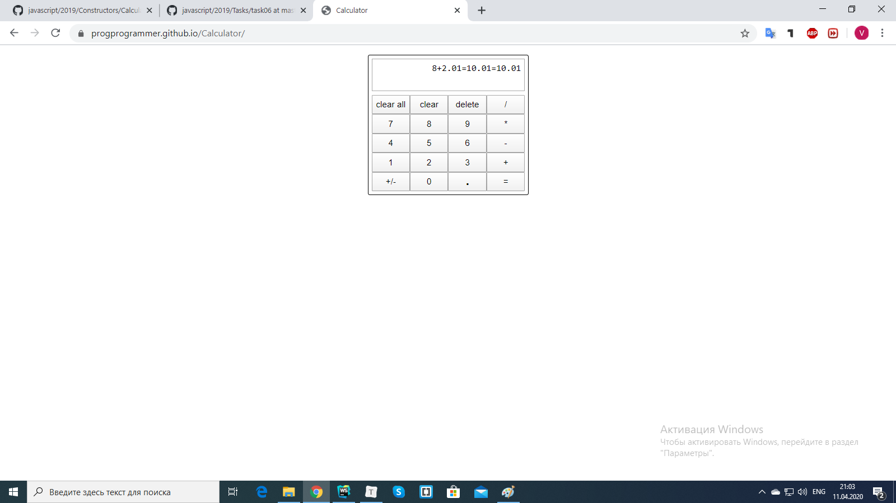

​	Программа-калькулятор предназначена для арифметических вычислений. С программой можно работать как при помощи мыши, сенсора, так и клавиатуры. В программе есть возможность сложения, вычитания, умножения, деления, смены знака у числа, удаления, частичной очистки и полной очистки. Функции клавиш:

"clear all" - очищает все символы;

"clear" - удаляет одно число или знак "/", "*", "-", "+". Если после результата совершения арифметической операции нет никакого знака, то нажатие на кнопку удалит все. Если есть знак или знак + число, то удалит все до результата + последнее число или знак.

"delete" - удаляет один символ при каждом нажатии. Если после результата совершения арифметической операции нет никакого знака, удалит сначала все символы до результата, потом по одному символу у результата. Если результат отрицательный и перед знаком числа "-" остался один символ, то "delete" удалит оба символа.

"/" - деление;

"*" - умножение;

"-" - вычитание;

"+" - сложение;

"." - знак дроби. Если нет числа и нажать на знак дроби, то появится число "0.". Если после знака оператора нажать на знак дроби, то появится число "0.".

"+/-" - смена знака у числа.

​	С кнопками "clear all", "clear" и "+/-" можно работать только при помощи мышки или сенсора.

​	В программе есть одна особенность. Если ввести одно число и нажать на знак "=", выйдет число 0.

​	Если число получено в результате арифметических вычислений, то после указания знака "=" выйдет тоже самое число.

