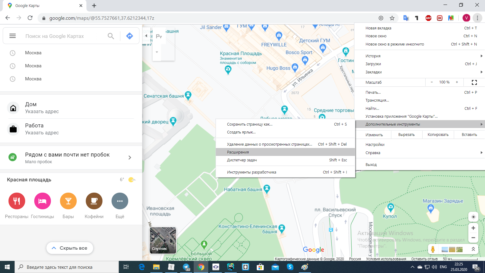
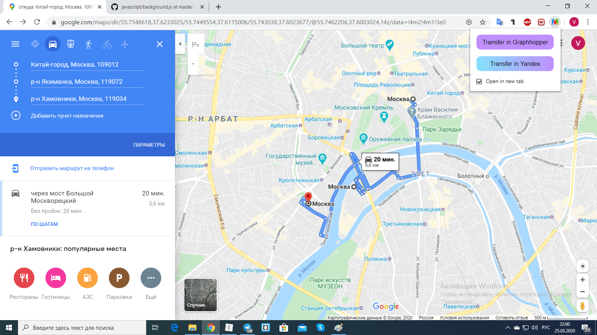

Плагин для переноса координат с Google Maps на Graphhopper либо на Yandex Maps. Работает только в браузере Google Chrome.

Для того, чтобы им воспользоваться, необходимо совершить следующие действия:

1) установить плагин, открыв браузер Google Chrome -> нажать на три точки -> дополнительные инструменты -> нажать на Расширения -> включить Режим разработчика переведя ползунок в правую сторону -> перетащить папку с плагином в окно расширений;

2) на панели инструментов браузера в правом верхнем углу должен отобразиться ярлык карты с красной меткой;

3) переходим на вкладку с гугл картой: https://www.google.com/maps/ -> а) выбираем нужный нам населенный пункт и жмем либо на кнопку "Как добраться"; б) либо на нужное вам здание и потом, на появившемся окне, нажать на кнопку "Как добраться". Если был выбран пункт "а", после нажатия на кнопку, нажать на нужное вам здание;

4) отметьте все остальные пункты, в которых хотите побывать. После этого нажмите на ярлык плагина -> нажмите на "Transfer in Graphhopper" или на "Transfer in Yandex". В этом случае карта Яндекс или Графогер откроется в том же разрешении, что и Гугл карта, на вкладке с Гугл картой;

5) если нужно открыть карту в новой вкладке, то перед нажатием на кнопку установите галочку в пункте "Open in new tab".

