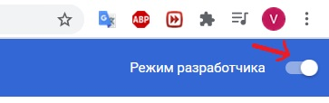

Плагин для удаления всплывающего окна с предложением включить рекламу на сайте "investing.com".

Для того, чтобы им воспользоваться, необходимо установить плагин в расширения браузера:

1) скачать архив с папкой, в которой находится программа. Скачать его можно на этой странице: https://github.com/ProgProgrammer/javascript способом, указанным в изображении;

2) открыть браузер Google Chrome -> нажать на три точки -> дополнительные инструменты -> Расширения;
 

3) распаковать папку "Remove popup program" из архива;

4) включить Режим разработчика переведя ползунок в правую сторону -> 

5) захватить левой кнопкой мыши папку под названием "Remove popup program";

6) перетащить папку с плагином в окно расширений браузера

Пользуйтесь сайтом без попапа и рекламы.