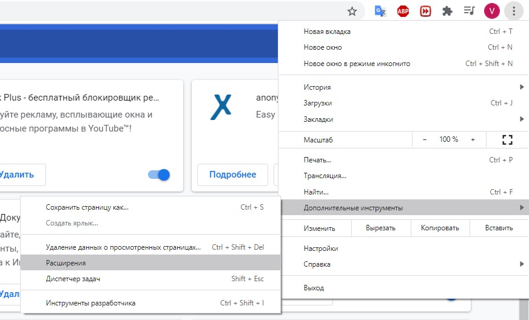
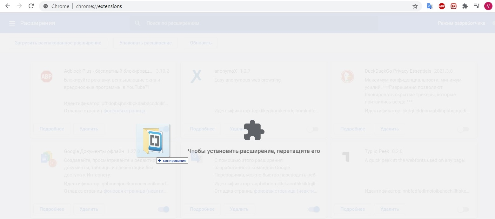

Плагин для удаления всплывающего окна с предложением включить рекламу на сайте "investing.com". Способ установки, указанный ниже, подходит только для персональных компьютеров и ноутбуков.

Для того, чтобы воспользоваться плагином, необходимо его установить в расширения браузера:

1) скачать архив с папкой, в которой находится программа. Скачать его можно на этой странице: https://github.com/ProgProgrammer/javascript способом, указанным в изображении;

2) распаковать папку "Remove popup program" из архива;

3) открыть браузер Google Chrome -> нажать на три точки -> дополнительные инструменты -> Расширения. Откроется окно расширений браузера;

4) в Расширениях включить Режим разработчика переведя ползунок в правую сторону -> 

5) захватить левой кнопкой мыши разархивированную папку под названием "Remove popup program";

6) перетащить папку с плагином в окно расширений браузера

Пользуйтесь сайтом без попапа, подписки и рекламы.