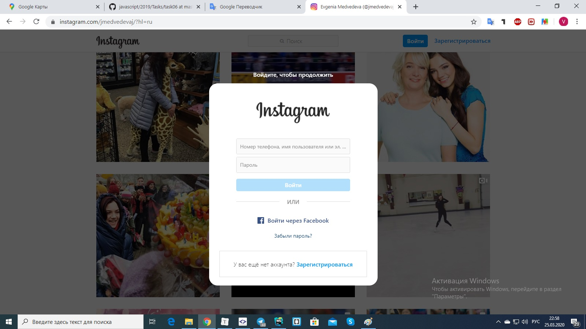

Плагин для автоматического отключения баннера Инстаграм, который появляется у незалогиненных пользователей при прокрутке аккаунта инстаграм.

Для того, чтобы использовать плагин, нужно перетащить его в расширения, предварительно активировав режим разработчика. после этого плагином можно пользоваться. Баннер на скриншоте вас больше не побеспокоит.

